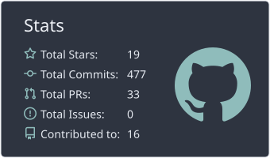
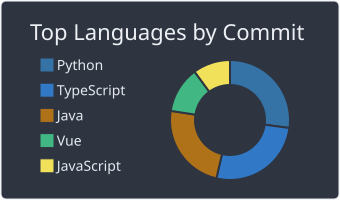

# Arthur Lunkes

	Fullstack Developer | Node.js | Vue.js | GraphQL | PostgreSQL | Flutter | DevOps | NGINX

	
	
	

## About me

- Fullstack developer focused on robust backends and modern frontends.
- Experience with web, mobile, IoT/embedded apps and automation.
- Strong interest in software architecture, performance and clean code.
- Location: Pato Branco - PR, Brazil.
- Work on academic, personal and collaborative projects (such as `unimater/cantina-unimater` and `Router-X/Websites_blocked_Brazil`).

## Languages and technologies

	

	
	

## Areas I work with

- Backend: Node.js, NestJS, Java Spring Boot, REST/GraphQL/WebSocket APIs.
- Frontend: Vue.js, React, TypeScript, Tailwind, SCSS.
- Databases: PostgreSQL, MySQL, SQLite, H2.
- DevOps and Infra: Docker, NGINX, GitHub Actions, Linux, Zabbix, Grafana, Datadog.
- Mobile: Flutter, React Native.
- IoT and automation: ESP32, C++, Python, Selenium.

## Featured projects

- [portfolio-decision-system](https://github.com/arthurlunkes/portfolio-decision-system): Capstone project (TCC) with Vue/NestJS/GraphQL/PostgreSQL.
- [Project_Contas_A_Receber](https://github.com/arthurlunkes/Project_Contas_A_Receber): Fullstack with Java Spring Boot, React e PostgreSQL.
- [ecommerce-backend](https://github.com/arthurlunkes/ecommerce-backend): Ecommerce backend with NestJS.
- [learning-NGINX](https://github.com/arthurlunkes/learning-NGINX): Hands-on NGINX studies with Docker.
- [my_finances](https://github.com/arthurlunkes/my_finances): Mobile app in Dart/Flutter.

## GitHub Stats

	
	

## Let's connect

	
	
	
	

---

Always open to collaborating on software, automation, IoT and digital products.
